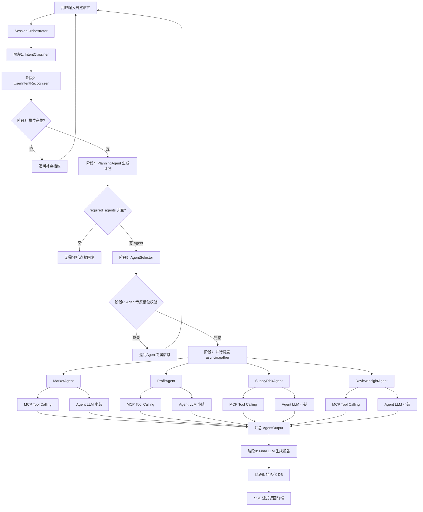

# ProductScout A2A 架构重构设计文档

## 一、重构后的整体架构

```
用户输入 (自然语言)
    │
    ▼
┌─────────────────────────────────────────────────┐
│              Session Orchestrator              │
│          (会话编排器 — 总控入口)                  │
└──────────┬──────────────────────────────────────┘
           │
           ▼
    ┌──────────────┐
    │  阶段1: 意图  │  IntentClassifier.classify()
    │  分类+槽位   │  → IntentResult
    └──────┬───────┘
           │
           ▼
    ┌──────────────┐
    │  阶段2: 用户  │  UserIntentRecognizer.recognize()
    │  画像识别    │  → UserIntent
    └──────┬───────┘
           │
           ▼
    ┌──────────────────┐
    │  阶段3: 槽位      │  判断 slots_missing
    │  完整性判断       │  缺失 → 追问
    │  (全局槽位)       │  完整 → 继续
    └──────┬───────────┘
           │ 槽位完整
           ▼
    ┌──────────────────┐
    │  阶段4: Planning  │  PlanningAgent.generate()
    │  (结构化输出)     │  → 返回 Plan {
    │                   │    required_agents: [...]
    │                   │    skip_agents: [...]
    │                   │    steps: [...]
    │                   │  }
    └──────┬───────────┘
           │
           ▼
    ┌──────────────────┐
    │  阶段5: Agent     │  AgentSelector.select(plan, user_intent, slots)
    │  Router +        │  → 返回 {agent_name: AgentConfig}
    │  Selector        │  → 包含: url, priority, timeout, required_slots
    └──────┬───────────┘
           │
           ▼
    ┌──────────────────┐
    │  阶段6: 槽位      │  对每个选中 Agent:
    │  二次校验        │  检查 Agent 专属槽位
    │  (Agent槽位)     │  缺失 → 返回 need_more_info
    └──────┬───────────┘
           │ 槽位完整
           ▼
    ┌──────────────────┐
    │  阶段7: 并行调度  │  asyncio.gather(
    │  多个 Agent      │    MarketAgent(task),
    │  (A2A 协议)      │    ProfitAgent(task),
    │                   │    ...
    │                   │  )
    └──────┬───────────┘
           │
    ┌───────┼───────┬───────┐
    ▼       ▼       ▼       ▼
  Market  Profit  Supply  Review
  Agent   Agent   Risk    Insight
    │       │       │       │
    ├─ MCP/工具调用 ────────┤
    ├─ raw_data 收集 ───────┤
    ├─ Agent LLM 小总结 ────┤
    └───────┬───────┬───────┘
            │
            ▼
    ┌──────────────────┐
    │  阶段8: 汇总层    │  Final LLM 整合
    │  生成最终报告    │  market_summary
    │                   │  + profit_summary
    │                   │  + supply_summary
    │                   │  + review_summary
    │                   │  → 最终报告
    └──────┬───────────┘
           │
           ▼
    ┌──────────────────┐
    

---

## 二、系统流程图 (Mermaid)



---

## 三、Agent Router + Agent Selector 设计

### 3.1 核心思路

**不再默认调用全部 Agent**。由 Planning 阶段输出 `required_agents` 和 `skip_agents`，AgentSelector 根据 Plan + UserIntent + Slots 综合决定最终调用哪些 Agent。

### 3.2 Agent 能力矩阵

| Agent | 负责意图 | 触发条件 | 权重影响 |
|---|---|---|---|
| MarketAgent | product_selection / product_compare | 需要市场数据或竞品分析 | trend_score(20%) + competition_score(20%) |
| ProfitAgent | product_selection / product_compare | 利润优先 / 老手 / 需要定价建议 | profit_score(25%) |
| SupplyRiskAgent | supply_inquiry / product_selection | 风险规避 / 新手 / 低风险偏好 | supply_score(15%) + risk_score(10%) |
| ReviewInsightAgent | product_selection | 追趋势 / 新手 / 需要口碑验证 | review_score(10%) |

### 3.3 AgentSelector 决策逻辑

```python
# agent_selector.py

AGENT_RULES = {
    "product_selection": {
        "always": ["MarketAgent"],
        "conditional": {
            "ProfitAgent": lambda intent, slots: (
                intent.goal == "profit_first"
                or intent.experience_level == "veteran"
                or "高利润" in slots.get("preferences", [])
            ),
            "SupplyRiskAgent": lambda intent, slots: (
                intent.goal == "risk_averse"
                or intent.experience_level == "newbie"
                or "低风险" in slots.get("preferences", [])
            ),
            "ReviewInsightAgent": lambda intent, slots: (
                intent.goal == "trend_chasing"
                or intent.experience_level == "newbie"
            ),
        },
    },
    "supply_inquiry": {
        "always": ["SupplyRiskAgent"],
        "conditional": {
            "MarketAgent": lambda intent, slots: slots.get("category") is not None,
        },
    },
    "product_compare": {
        "always": ["MarketAgent", "ReviewInsightAgent"],
        "conditional": {},
    },
}


class AgentSelector:
    @staticmethod
    def select(
        plan,
        user_intent,
        slots,
    ) -> dict:
        """核心选择方法，返回 {agent_name: AgentConfig}"""
        required = set(plan.required_agents)
        skip = set(plan.skip_agents)

        # 1. Plan 明确指定 → 以 Plan 为准
        if required:
            agents = {}
            for agent_name in required:
                if agent_name in skip:
                    continue
                agents[agent_name] = AgentConfig(
                    name=agent_name,
                    url=A2A_AGENTS[agent_name],
                    required_slots=AGENT_SLOTS.get(agent_name, {}),
                )
            return agents

        # 2. 走规则路由
        intent = plan.primary_intent or "product_selection"
        rules = AGENT_RULES.get(intent, AGENT_RULES["product_selection"])

        agents = {}
        for agent_name in rules["always"]:
            if agent_name not in skip:
                agents[agent_name] = AgentConfig(
                    name=agent_name, url=A2A_AGENTS[agent_name],
                    required_slots=AGENT_SLOTS.get(agent_name, {}),
                )

        for agent_name, condition in rules.get("conditional", {}).items():
            if agent_name in skip:
                continue
            if condition(user_intent, slots or {}):
                agents[agent_name] = AgentConfig(
                    name=agent_name, url=A2A_AGENTS[agent_name],
                    required_slots=AGENT_SLOTS.get(agent_name, {}),
                )

        # 3. 兜底: 至少 MarketAgent
        if not agents:
            agents["MarketAgent"] = AgentConfig(
                name="MarketAgent", url=A2A_AGENTS["MarketAgent"],
                required_slots=AGENT_SLOTS.get("MarketAgent", {}),
            )
        return agents
```

### 3.4 路由流程

```
Planning.required_agents 非空?
  ├── 是 → 按 Plan 指定的 Agent 调度
  └── 否 → 走规则路由:
            ├── supply_inquiry → [SupplyRiskAgent]
            ├── product_compare → [MarketAgent, ReviewInsightAgent]
            ├── report_lookup → 无 Agent (直接查DB)
            └── product_selection:
                    ├── always: [MarketAgent]
                    ├── profit_first/veteran → +ProfitAgent
                    ├── risk_averse/newbie/低风险 → +SupplyRiskAgent
                    └── trend_chasing/newbie → +ReviewInsightAgent

---

## 四、Planning 输出结构化设计

### 4.1 新版 Plan 数据结构

```python
# schemas.py 新增

from pydantic import BaseModel, Field


class PlanStep(BaseModel):
    """单个执行步骤"""
    step_id: int
    description: str                       # "分析市场趋势和竞品"
    agent_name: str                        # "MarketAgent"
    depends_on: list[int] = Field(default_factory=list)
    priority: int = 1                      # 1=高 2=中 3=低


class Plan(BaseModel):
    """Planning Agent 结构化输出"""
    primary_intent: str = "product_selection"
    required_agents: list[str] = Field(   # ★ 核心字段
        default_factory=list,
        description="需要调用的 Agent 列表"
    )
    skip_agents: list[str] = Field(        # ★ 核心字段
        default_factory=list,
        description="明确跳过的 Agent 及原因"
    )
    skip_reason: str = ""                  # 跳过原因(面向用户可读)
    steps: list[PlanStep] = Field(default_factory=list)
    confidence: float = 0.8                # 计划置信度
```

### 4.2 Planning 输出的 JSON 示例

```json
{
  "primary_intent": "product_selection",
  "required_agents": [
    "MarketAgent",
    "ProfitAgent",
    "SupplyRiskAgent"
  ],
  "skip_agents": [
    "ReviewInsightAgent"
  ],
  "skip_reason": "用户以利润和供应链稳定性为主要考量，未要求评论分析，跳过 ReviewInsightAgent 可节省约 30% Token 消耗",
  "steps": [
    {
      "step_id": 1,
      "description": "分析市场趋势和竞品",
      "agent_name": "MarketAgent",
      "depends_on": [],
      "priority": 1
    },
    {
      "step_id": 2,
      "description": "测算利润空间",
      "agent_name": "ProfitAgent",
      "depends_on": [],
      "priority": 1
    },
    {
      "step_id": 3,
      "description": "评估供应链风险",
      "agent_name": "SupplyRiskAgent",
      "depends_on": [],
      "priority": 2
    }
  ],
  "confidence": 0.85
}
```

### 4.3 PlanningAgent 实现要点

```python
# plan_engine.py 改造

PLANNING_SYSTEM_PROMPT = """你是电商选品任务规划专家。

根据用户意图、用户画像和槽位信息，决定需要调用哪些 A2A Agent。

Agent 清单:
- MarketAgent: 市场趋势 + 竞品分析 + 价格带
- ProfitAgent: 利润测算 + 建议售价 + 盈亏平衡
- SupplyRiskAgent: 供应商评估 + 合规风险 + 备货建议
- ReviewInsightAgent: 评论 RAG 检索 + 痛点提取 + 卖点机会

决策原则:
1. 只选与用户需求直接相关的 Agent，能少则少
2. 如果用户没提利润/价格 → 不选 ProfitAgent
3. 如果用户没提风险/供应商 → 不选 SupplyRiskAgent
4. 如果用户没提评论/口碑 → 不选 ReviewInsightAgent
5. 如果是简单的类目查询 → 可以只用 MarketAgent
6. skip_reason 要写清楚为什么跳过，让用户可理解

当前日期: {current_date}
用户意图: {intent_json}
用户画像: {user_intent_json}
槽位信息: {slots_json}
用户查询: {user_query}

输出 JSON:
{{
  "primary_intent": "...",
  "required_agents": ["MarketAgent"],
  "skip_agents": ["ProfitAgent"],
  "skip_reason": "...",
  "steps": [
    {{"step_id": 1, "description": "...", "agent_name": "MarketAgent", "depends_on": [], "priority": 1}}
  ],
  "confidence": 0.9
}}"""
```

### 4.4 Planning 跳过条件（启发式前置判断）

以下情况**直接跳过 Planning LLM 调用**，使用规则生成 Plan：

| 条件 | Plan | 节省 |
|---|---|---|
| 意图=supply_inquiry | required=[SupplyRiskAgent], skip=其他3个 | 1次 LLM 调用 |
| 意图=report_lookup | required=[], 直接查DB | 全部 Agent |
| 意图=product_selection + slot只有category | required=[MarketAgent], skip=其他3个 | 3个 Agent + 1次 Planning LLM |
| preferences=['低风险'] | required=[MarketAgent, SupplyRiskAgent] | 2个 Agent |

```python
def should_skip_planning_llm(intent: str, slots: dict, user_intent) -> Plan | None:
    """返回 Plan 表示直接走规则，返回 None 表示需要 LLM Planning"""
    
    if intent == "supply_inquiry":
        return Plan(
            primary_intent=intent,
            required_agents=["SupplyRiskAgent"],
            skip_agents=["MarketAgent", "ProfitAgent", "ReviewInsightAgent"],
            skip_reason="供应链咨询只需 SupplyRiskAgent",
        )
    
    if intent == "report_lookup":
        return Plan(
            primary_intent=intent,
            required_agents=[],
            skip_agents=["MarketAgent", "ProfitAgent", "SupplyRiskAgent", "ReviewInsightAgent"],
            skip_reason="历史报告查询不需要 Agent 分析",
        )
    
    # 只有 category 没有价格/季节 → 先查市场
    if intent == "product_selection" and slots.get("category"):
        has_full_context = all([
            slots.get("price_min") is not None or slots.get("price_max") is not None,
            slots.get("season"),
        ])
        if not has_full_context:
            return Plan(
                primary_intent=intent,
                required_agents=["MarketAgent"],
                skip_agents=["ProfitAgent", "SupplyRiskAgent", "ReviewInsightAgent"],
                skip_reason="槽位不完整，先用 MarketAgent 探市场，待用户补充信息后追加分析",
            )
    
    return None  # 需要 LLM Planning


## 五、Agent 专属槽位机制

### 5.1 全局槽位 vs Agent 专属槽位

**全局槽位** (已有): category, season, price_min, price_max, preferences
→ 用于候选商品筛选和基础上下文

**Agent 专属槽位** (新增): 每个 Agent 有自己的关键参数
→ 如果缺失，Agent 返回 need_more_info

```
全局槽位 (shared)
    │
    ├── MarketAgent 专属槽位
    │   ├── market: str          # 目标市场 (Amazon/Walmart/Shopee)
    │   ├── time_range: str      # 分析时间范围 (最近3月/半年)
    │   └── competitor_count: int # 竞品分析数量
    │
    ├── ProfitAgent 专属槽位
    │   ├── purchase_cost: float  # 采购成本 (可从DB查)
    │   ├── platform_fee: float   # 平台扣点 (可从DB查)
    │   ├── shipping_cost: float  # 物流成本 (可从DB查)
    │   └── ad_budget: float      # 广告预算
    │
    ├── SupplyRiskAgent 专属槽位
    │   ├── supplier_region: str  # 供应商地区
    │   ├── lead_time_max: int    # 最大交期容忍
    │   └── cert_required: bool   # 是否需要认证
    │
    └── ReviewInsightAgent 专属槽位
        ├── asin: str             # Amazon ASIN
        ├── review_count: int     # 最小评论数
        └── rating_range: tuple   # 评分范围
```

### 5.2 AgentConfig 数据结构

```python
@dataclass
class AgentConfig:
    name: str
    url: str
    required_slots: dict[str, SlotDef]  # Agent 专属槽位定义
    timeout: int = 120
    priority: int = 1                     # 优先级(调度顺序)
    fallback_enabled: bool = True         # 失败是否降级


@dataclass
class SlotDef:
    key: str
    label: str               # 面向用户的槽位名
    required: bool = False   # 是否必填
    default: Any = None      # 默认值
    source: str = "db"       # db(从数据库查) / user(必须用户提供) / derived(可推导)
```

### 5.3 Agent 专属槽位校验逻辑

```python
# agent_slot_validator.py

AGENT_SLOTS: dict[str, dict[str, SlotDef]] = {
    "MarketAgent": {
        "category": SlotDef(key="category", label="商品类目", required=True, source="user"),
        "market": SlotDef(key="market", label="目标市场", required=False, default="Amazon", source="user"),
    },
    "ProfitAgent": {
        "purchase_cost": SlotDef(key="purchase_cost", label="采购成本", required=False, source="db"),
        "platform_fee": SlotDef(key="platform_fee", label="平台扣点率", required=False, source="db"),
    },
    "SupplyRiskAgent": {
        "category": SlotDef(key="category", label="商品类目", required=True, source="user"),
        "lead_time_max": SlotDef(key="lead_time_max", label="最大交期", required=False, default=30, source="user"),
    },
    "ReviewInsightAgent": {
        "review_count": SlotDef(key="review_count", label="最小评论数", required=False, default=10, source="derived"),
    },
}


class AgentSlotValidator:
    @staticmethod
    def validate(agent_name: str, slots: dict) -> SlotValidationResult:
        """校验 Agent 的专属槽位是否满足"""
        slot_defs = AGENT_SLOTS.get(agent_name, {})
        missing = []
        
        for key, sdef in slot_defs.items():
            if not sdef.required:
                continue
            val = slots.get(key)
            if val is None or val == "":
                missing.append(key)
        
        if missing:
            return SlotValidationResult(
                ready=False,
                missing_slots=missing,
                question=_build_missing_question(agent_name, missing),
            )
        return SlotValidationResult(ready=True)

    @staticmethod
    def fill_from_db(agent_name: str, product_id: int) -> dict:
        """从数据库自动填充 Agent 专属槽位"""
        # 例如: ProfitAgent 的 purchase_cost 从 product_costs 表查
        # 例如: ReviewInsightAgent 的 review_count 从 COUNT(*) 查
        ...
```

### 5.4 need_more_info 处理流程

```
AgentSlotValidator.validate(agent_name, slots)
    │
    ├── ready=True → 继续调度 Agent
    │
    └── ready=False → 返回给 SessionOrchestrator:
            {
              "status": "need_more_info",
              "agent": "ProfitAgent",
              "missing_slots": ["purchase_cost"],
              "question": "需要商品的采购成本信息，请问成本大约是多少？"
            }
            → SessionOrchestrator 向用户追问
            → 用户回复 → 补充 slots → 重新校验 → 调度


## 六、Agent 调度逻辑

### 6.1 调度核心流程

```python
# agent_dispatcher.py

async def dispatch_agents(
    plan: Plan,
    user_intent: UserIntent,
    slots: dict,
    candidates: list[dict],
) -> list[ProductAnalysisResult]:
    """核心调度: 选择 → 校验 → 执行 → 聚合"""

    # 1. 选择 Agent
    agents = AgentSelector.select(plan, user_intent, slots)
    logger.info(f"调度 Agent: {list(agents.keys())}")

    # 2. 校验 Agent 专属槽位
    need_more_info = []
    for agent_name, config in agents.items():
        validation = AgentSlotValidator.validate(agent_name, slots)
        if not validation.ready:
            config.slot_validation = validation
            need_more_info.append(config)

    # 3. 如果有 Agent 缺槽位, 返回追问
    if need_more_info:
        return NeedMoreInfoResult(agents=need_more_info)

    # 4. 按优先级分组: 高优先级先执行, 低优先级后执行
    high_priority = {
        name: cfg for name, cfg in agents.items() if cfg.priority == 1
    }
    low_priority = {
        name: cfg for name, cfg in agents.items() if cfg.priority > 1
    }

    # 5. 并行执行高优先级 Agent
    all_results = {}
    if high_priority:
        hp_results = await asyncio.gather(*[
            _execute_single_agent(name, cfg, candidates, slots)
            for name, cfg in high_priority.items()
        ])
        for name, result in zip(high_priority.keys(), hp_results):
            all_results[name] = result

    # 6. 串行执行低优先级 Agent (可选: 依赖高优先级结果)
    for name, cfg in low_priority.items():
        result = await _execute_single_agent(name, cfg, candidates, slots)
        all_results[name] = result

    # 7. 聚合结果
    return await _aggregate_results(candidates, all_results)
```

### 6.2 单 Agent 执行流程

```python
async def _execute_single_agent(
    agent_name: str,
    config: AgentConfig,
    candidates: list[dict],
    slots: dict,
) -> AgentOutput:
    """单个 Agent 完整执行流程: MCP Tool → raw_data → LLM 小结"""

    results_for_all_products = []

    for product in candidates:
        try:
            # Step 1: 调用 A2A Agent (内部做 MCP Tool Calling)
            a2a_result = await call_a2a_agent(
                agent_name=agent_name,
                agent_url=config.url,
                input_data=_build_agent_input(product, slots),
            )

            # Step 2: 提取 Agent 输出
            output = AgentOutput(
                agent=agent_name,
                product_id=product["product_id"],
                status=a2a_result.status,
                raw_data=a2a_result.details.get("raw_data", {}),
                summary=a2a_result.summary,
                scores=a2a_result.scores,
                suggestions=a2a_result.suggestions,
            )
            results_for_all_products.append(output)

        except asyncio.TimeoutError:
            logger.warning(f"{agent_name} 超时, 使用默认结果")
            results_for_all_products.append(_fallback_output(agent_name, product["product_id"]))

    return AgentOutput.merge(agent_name, results_for_all_products)
```

### 6.3 超时与并发控制

```python
# 全局信号量: 限制同时调用的 MCP 连接数
MCP_SEMAPHORE = asyncio.Semaphore(8)      # 最多 8 个 MCP 并发
AGENT_SEMAPHORE = asyncio.Semaphore(4)    # 最多 4 个 Agent 并发
LLM_SEMAPHORE = asyncio.Semaphore(3)      # 最多 3 个 LLM 并发

AGENT_TIMEOUTS = {
    "MarketAgent": 90,        # 市场数据量大
    "ProfitAgent": 60,        # 计算简单
    "SupplyRiskAgent": 60,    # 规则查询
    "ReviewInsightAgent": 90, # RAG 检索慢
}
```

### 6.4 失败降级策略

```
Agent 失败 / 超时:
    ├── 不影响其他 Agent 继续执行
    ├── 失败的 Agent 使用默认评分 (60分)
    ├── 标记 status=failed, 记录 error 信息
    └── 最终报告中标注该维度为"数据不足"

MCP 调用失败:
    ├── Agent 内部重试 1 次
    ├── 仍失败 → Agent 返回 partial 状态
    └── AgentResult 的 fallback=True 标记

---

## 七、Python 代码结构建议

### 7.1 重构后的文件结构

```
backend/
├── api_server.py                 # FastAPI 入口 (不变)
├── config.py                     # 配置 (不变)
├── database.py                   # 数据库连接 (不变)
├── create_logger.py              # 日志 (不变)
│
├── schemas.py                    # ★ 扩展: Plan, PlanStep, AgentConfig,
│                                 #   AgentOutput, SlotDef, SlotValidationResult
│
├── scoring.py                    # ★ 扩展: 支持动态权重 (已部分实现)
│
├── prompts.py                    # ★ 扩展: 新增 PLANNING_SYSTEM_PROMPT,
│                                 #   AGENT_SUMMARY_PROMPT, FINAL_REPORT_V2
│
│ ── 阶段1-2: 意图识别 ──────────────────────────
├── intent_service.py             # IntentClassifier (已有)
├── user_intent_service.py        # UserIntentRecognizer (已有)
│
│ ── 阶段3: 槽位管理 ────────────────────────────
├── slot_manager.py               # ★ 新增: 全局槽位 + Agent 专属槽位管理
│   ├── GlobalSlotManager         #   全局槽位提取/合并/缺失判断
│   └── AgentSlotValidator        #   Agent 专属槽位校验
│
│ ── 阶段4: Planning ────────────────────────────
├── plan_engine.py                # ★ 重构: PlanningAgent (结构化 Plan 输出)
│   ├── should_skip_planning_llm  #   启发式跳过 LLM Planning
│   └── planning_agent            #   LLM Planning (输出 required_agents)
│
│ ── 阶段5: Agent Router ────────────────────────
├── agent_selector.py             # ★ 新增: AgentSelector
│   ├── AGENT_RULES               #   规则矩阵
│   └── AgentSelector.select()    #   选择入口
│
│ ── 阶段6-7: 调度与执行 ────────────────────────
├── agent_dispatcher.py           # ★ 新增: Agent 调度器
│   ├── dispatch_agents()         #   调度入口
│   ├── _execute_single_agent()   #   单 Agent 执行
│   └── _aggregate_results()      #   结果聚合
│
├── selection_service.py          # ★ 精简: 只保留 query_candidates,
│                                 #   save_report, save_logs, generate_report
│
├── session_orchestrator.py       # ★ 重构: 串联全部阶段
│   └── stream_message() → 阶段1-9
│
│ ── A2A Agent (不变) ───────────────────────────
├── a2a_server/
│   ├── a2a_base.py               # A2A 协议基座
│   ├── a2a_react.py              # MCP Tool Calling (LangGraph ReAct)
│   ├── market_server.py
│   ├── profit_server.py
│   ├── supply_risk_server.py
│   └── review_insight_server.py
│
│ ── MCP Server (不变) ──────────────────────────
├── mcp_server/
│   ├── mcp_market_server.py
│   ├── mcp_profit_server.py
│   ├── mcp_supply_risk_server.py
│   └── mcp_review_server.py
```

### 7.2 新增文件清单

| 文件 | 职责 | 优先级 |
|---|---|---|
| `agent_selector.py` | Agent 动态选择 (规则 + Plan 驱动) | P0 |
| `agent_dispatcher.py` | Agent 并行调度 + 超时 + 降级 | P0 |
| `slot_manager.py` | 全局槽位 + Agent 专属槽位校验 | P1 |
| `schemas.py (扩展)` | Plan / AgentConfig / AgentOutput 数据类 | P0 |
| `prompts.py (扩展)` | Planning / Agent Summary / Final Report V2 | P1 |
| `plan_engine.py (重构)` | Planning 输出 structured Plan | P1 |
| `session_orchestrator.py (重构)` | 接入 AgentSelector + Dispatcher | P0 |
| `selection_service.py (精简)` | 去掉 select_agents, 保留查询和持久化 | P1 |

### 7.3 不可变文件

这些文件逻辑正确，无需修改:

- `a2a_server/a2a_base.py` — A2A 协议层
- `a2a_server/a2a_react.py` — MCP Tool Calling 基座
- `mcp_server/*` — 4 个 MCP Server
- `config.py` — 配置
- `database.py` — DB 连接
- `memory.py` — 四组件记忆
- `intent_service.py` — 意图分类
- `user_intent_service.py` — 用户画像

---

## 八、LangGraph / LangChain 实现思路

### 8.1 当前已有基础

项目已使用 LangGraph 的 `create_react_agent` 做 MCP Tool Calling (在 `a2a_react.py`)。这部分保持不变。

### 8.2 可选的 LangGraph StateGraph 编排

如果需要将整个 9 阶段流程建模为 LangGraph:

```python
from typing import TypedDict
from langgraph.graph import StateGraph, END


class OrchestratorState(TypedDict):
    query: str
    slots: dict
    user_intent: dict
    plan: dict                    # Plan.model_dump()
    selected_agents: dict         # {agent_name: AgentConfig}
    candidates: list[dict]
    agent_results: dict           # {agent_name: AgentOutput}
    final_report: str
    error: str | None


def build_orchestrator_graph():
    builder = StateGraph(OrchestratorState)

    builder.add_node("intent_classify", intent_classify_node)
    builder.add_node("user_intent", user_intent_node)
    builder.add_node("slot_check", slot_check_node)
    builder.add_node("ask_slots", ask_slots_node)
    builder.add_node("planning", planning_node)
    builder.add_node("agent_select", agent_select_node)
    builder.add_node("agent_slot_check", agent_slot_check_node)
    builder.add_node("dispatch_agents", dispatch_agents_node)
    builder.add_node("final_report", final_report_node)

    builder.add_edge("intent_classify", "user_intent")
    builder.add_edge("user_intent", "slot_check")

    builder.add_conditional_edges("slot_check", slot_router, {
        "ask": "ask_slots",
        "continue": "planning",
    })
    builder.add_conditional_edges("planning", plan_router, {
        "no_agents": END,
        "dispatch": "agent_select",
    })
    builder.add_edge("agent_select", "agent_slot_check")
    builder.add_conditional_edges("agent_slot_check", agent_slot_router, {
        "ask": "ask_slots",
        "dispatch": "dispatch_agents",
    })
    builder.add_edge("dispatch_agents", "final_report")
    builder.add_edge("final_report", END)

    builder.set_entry_point("intent_classify")
    return builder.compile()
```

### 8.3 建议

**第一版不使用 LangGraph StateGraph 编排**。原因是:

1. 当前 `session_orchestrator.py` 的流式 SSE 逻辑已经很复杂
2. StateGraph 的全量状态传递与 SSE 流式输出的兼容性需要额外处理
3. 现有 A2A Agent 内部的 LangGraph ReAct 已经足够

**重构重点放在 AgentSelector + AgentDispatcher 两个新模块**，用纯 async/await 串联即可。

### 8.4 Agent 内部优化 (可选)

当前 Agent 使用 `create_react_agent` (ReAct 模式)。如果响应速度仍慢，可以改造为:

```
ReAct (当前):
  LLM → Tool Call → LLM → Tool Call → ... → 最终输出
  优化: 限制 max_iterations=3, 减少无效 Tool Call 循环

Tool Calling (可选):
  LLM 一次决定调用哪些工具 → 并行执行所有 Tool Call → 一次 LLM 总结
  优势: 减少 LLM 调用次数
  劣势: 工具调用灵活性降低
```

---

## 九、如何减少 Agent 无效调用

### 9.1 三级过滤机制

```
第一级: 意图过滤 (IntentClassifier)
    report_lookup → 0 个 Agent (直接查DB)
    general_chat → 0 个 Agent (直接回复)
    supply_inquiry → 1 个 Agent (SupplyRiskAgent)

第二级: Planning 过滤 (PlanningAgent / 启发式规则)
    只查类目 → 1 个 Agent (MarketAgent)
    完整选品 → 2-4 个 Agent (按需)
    利润优先 → MarketAgent + ProfitAgent
    风险规避 → MarketAgent + SupplyRiskAgent

第三级: Agent 专属槽位过滤 (AgentSlotValidator)
    ProfitAgent 缺成本数据 → 跳过,标注"成本数据不足"
    ReviewInsightAgent 缺评论数据 → 跳过,标注"评论数据不足"
```

### 9.2 量化节省效果

| 场景 | 当前调用 | 重构后 | 节省 |
|---|---|---|---|
| 类目查询 | 4 Agent | 1 Agent (Market) | 75% |
| 利润分析 | 4 Agent | 2 Agent (Market+Profit) | 50% |
| 供应链咨询 | 4 Agent | 1 Agent (SupplyRisk) | 75% |
| 完整选品(无利润偏好) | 4 Agent | 3 Agent (跳过Profit) | 25% |
| 完整选品(新手) | 4 Agent | 4 Agent (全调) | 0% |

平均预期节省: 40-50% 的 Agent 调用量。

### 9.3 缓存去重

```python
# Agent 结果缓存 (同一个 request 内,同一个 product 不重复调 Agent)
_request_cache: dict[str, dict[str, AgentOutput]] = {}

async def _execute_agent_cached(
    agent_name: str,
    product_id: int,
    ...
) -> AgentOutput:
    cache_key = f"{agent_name}:{product_id}"
    if cache_key in _request_cache:
        return _request_cache[cache_key]
    result = await _execute_single_agent(...)
    _request_cache[cache_key] = result
    return result
```

---

## 十、如何提升系统响应速度

### 10.1 并行化关键路径

```
当前 (串行较多):
  意图识别 → 用户画像 → 槽位判断 → Planning → 选Agent → 调Agent(并行) → 报告

优化后:
  意图识别 ─┐
  用户画像 ─┤ → 合并后 → 槽位判断 → Planning → Agent调度
             (并行)

  MarketAgent ─┐
  ProfitAgent ─┤ → asyncio.gather → 聚合 → Final LLM → 流式返回
  ...          (并行)
```

### 10.2 流式逐商品返回

当前 `session_orchestrator.py` 已使用 `asyncio.as_completed` 逐商品返回。在此基础上优化:

```python
# 优先返回评分最高的商品，让用户先看到最有价值的
for done in asyncio.as_completed(tasks):
    product = await done
    completed.append(product)
    completed.sort(key=lambda p: p.final_score, reverse=True)
    # 立即推送给前端
    yield {"event": "products", "data": {"products": [p.model_dump() for p in completed]}}
```

### 10.3 LLM 调用时间优化

| 优化项 | 预期收益 |
|---|---|
| LLM API 使用 HTTP/2 或连接池 | ~15% |
| temperature=0.1 降低生成长度 | ~10% |
| max_tokens 限制 (Agent 小结 300, Final报告 3000) | ~20% |
| 跳过低价值 LLM 调用 (启发式 Plan) | ~30% |
| 并行 LLM 调用 (Final LLM + Agent LLM 同时进行) | ~25% |

### 10.4 MCP 调用复用

```python
# 同一次请求中,多个商品共享同一个 MCP 工具结果
_mcp_result_cache: dict[str, dict] = {}

async def _call_mcp_cached(tool_name: str, params_json: str) -> dict:
    cache_key = f"{tool_name}:{params_json}"
    if cache_key in _mcp_result_cache:
        return _mcp_result_cache[cache_key]
    result = await _call_mcp(tool_name, params_json)
    _mcp_result_cache[cache_key] = result
    return result
```

---

## 十一、如何降低 Token 消耗

### 11.1 Token 消耗分析

单次完整选品 (4 Agent × 3 Product, 每个 Agent 3 Tool Calls):

| 环节 | Token | 占比 |
|---|---|---|
| 意图识别 LLM | ~500 | 2% |
| 用户画像 LLM | ~400 | 1% |
| Planning LLM | ~800 | 3% |
| Agent LLM × 12 (4×3) | ~18,000 | 65% |
| Final LLM 报告 | ~3,000 | 11% |
| MCP Tool Calling context | ~5,000 | 18% |

**重构后 (3 Agent × 3 Product)**:

| 环节 | Token | 节省 |
|---|---|---|
| Agent LLM × 9 | ~13,500 | -25% |
| 总量 | ~23,200 | 约 17% |

**重构后 (2 Agent, 启发式 Plan)**:

| 环节 | Token | 节省 |
|---|---|---|
| Planning LLM | 0 (跳过) | -3% |
| Agent LLM × 6 | ~9,000 | -50% |
| 总量 | ~18,300 | 约 35% |

### 11.2 具体优化措施

1. **Prompt 压缩**: Agent 小结 Prompt 控制在 500 token 以内
2. **MCP Tool 结果截断**: 只传前 5 条结果 + 统计摘要给 LLM (不传全量原始数据)
3. **AGENT_OUTPUT_MAX_TOKENS = 500**: Agent LLM 输出限制
4. **跳过 Planning LLM**: 简单场景走启发式规则 (省 800 token)
5. **复用 System Prompt**: 使用 OpenAI prompt caching (自动生效)
6. **Context 窗口控制**: conversation_history 只传最近 3 轮

```python
# MCP 结果截断
def _compact_mcp_result(raw_data: dict, max_items: int = 5) -> dict:
    """截断 MCP 返回的大列表,保留统计摘要 + 前 N 条"""
    result = {}
    for key, value in raw_data.items():
        if isinstance(value, list) and len(value) > max_items:
            result[key] = value[:max_items]
            result[f"{key}_total"] = len(value)
        else:
            result[key] = value
    return result
```

---

## 十二、如何实现真正的动态 Agent 调度

### 12.1 核心原则

> **以 Plan 为准,意图和用户画像为辅助修正,槽位为硬约束**

```
最终调用的 Agent = Plan.required_agents (LLM 决策)
                   - Plan.skip_agents (LLM 明确跳过)
                   + AgentSelector 规则补位 (Plan 为空时)
                   - AgentSlotValidator 剔除 (槽位不满足)
```

### 12.2 完整调度决策树

```
用户输入 → IntentClassifier
    │
    ├── intent=general_chat → 0 Agent, 直接聊天回复
    ├── intent=report_lookup → 0 Agent, 查 DB
    ├── intent=slot_reply → 补槽位 → 重新意图识别
    │
    └── intent=product_selection/supply_inquiry/product_compare
        │
        ├── 全局槽位不完整 → 追问补全
        │
        └── 全局槽位完整
            │
            ├── 启发式 Plan 判断 (should_skip_planning_llm)
            │   ├── 匹配 → 直接生成 Plan (不用 LLM)
            │   └── 不匹配 ↓
            │
            ├── LLM Planning (产生 Plan)
            │
            ├── Plan.required_agents 为空 → 0 Agent, 终止
            │
            ├── AgentSelector.select(Plan, UserIntent, Slots)
            │   └── 产生 final_agents
            │
            ├── AgentSlotValidator.validate(final_agents, slots)
            │   ├── 有 Agent 缺槽位:
            │   │   ├── source=db → 自动从DB填充 → 重新校验
            │   │   └── source=user → need_more_info → 追问用户
            │   └── 全部就绪 ↓
            │
            ├── AgentDispatcher.dispatch(final_agents, candidates)
            │   ├── 高优先: asyncio.gather(所有 priority=1)
            │   ├── 低优先: 串行执行 priority>1
            │   └── 每个 Agent 内部: MCP Tool Calling → raw_data → LLM 小结
            │
            ├── 聚合 AgentOutput → Final LLM 报告
            │
            └── 持久化 + SSE 流式返回
```

### 12.3 Session Orchestrator 重构后的关键调用点

```python
# session_orchestrator.py 中的 _stream_selection() 改造

async def _stream_selection(request, session, slots, user_intent=None):
    top_k = _extract_top_k(request.message)
    query = _compose_selection_query(request.message, slots)

    # ★ 阶段4: Planning (可能跳过LLM)
    plan = should_skip_planning_llm(intent, slots, user_intent)
    if plan is None:
        plan = await planning_agent(request.message, [intent], slots, context)

    # ★ 如果没有需要的 Agent, 直接回复
    if not plan.required_agents:
        yield {"event": "delta", "data": {"content": f"根据你的需求,不需要进行多维度分析。{plan.skip_reason}"}}
        return

    yield {"event": "delta", "data": {
        "content": f"任务规划: 将调用 {plan.required_agents} (跳过 {plan.skip_agents})\n理由: {plan.skip_reason}\n\n"
    }}

    # ★ 阶段5: Agent 选择
    selected_agents = AgentSelector.select(plan, user_intent, slots)
    yield {"event": "delta", "data": {
        "content": f"选定 {len(selected_agents)} 个 Agent: {', '.join(selected_agents.keys())}\n\n"
    }}

    # ★ 阶段6: Agent 专属槽位校验
    for agent_name, config in selected_agents.items():
        validation = AgentSlotValidator.validate(agent_name, slots)
        if not validation.ready:
            yield {"event": "follow_up", "data": {
                "question": validation.question,
                "missing_slots": validation.missing_slots,
                "agent": agent_name,
            }}
            return

    # ★ 阶段7: 调度 (与现有逻辑兼容)
    constraints = Constraints(...)
    candidates = await asyncio.to_thread(query_candidate_products, constraints, min(top_k * 3, 20))

    products_to_analyze = candidates[: min(3, top_k)]

    tasks = [
        asyncio.create_task(
            analyze_single_product(product, constraints, query, agents=selected_agents)
        )
        for product in products_to_analyze
    ]
    # ... 后续逻辑不变
```

### 12.4 改造实施路径

```
Phase 1 (P0 - 最小可行改造):
    1. schemas.py 新增 Plan, AgentConfig, AgentOutput 数据类
    2. 新增 agent_selector.py (AGENT_RULES + AgentSelector)
    3. 重构 session_orchestrator.py 接入 AgentSelector
    4. 测试: 输入"利润分析" → 只调 MarketAgent + ProfitAgent

Phase 2 (P1 - Planning 升级):
    5. 改造 plan_engine.py 输出 structured Plan
    6. 新增 should_skip_planning_llm 启发式规则
    7. 测试: 输入"供应链风险" → Plan.skip = [MarketAgent, ProfitAgent, ReviewInsightAgent]

Phase 3 (P2 - 槽位升级):
    8. 新增 slot_manager.py (AgentSlotValidator)
    9. Agent 内部增加专属槽位校验
    10. need_more_info 机制

Phase 4 (P3 - 完整优化):
    11. 新增 agent_dispatcher.py (优先级调度)
    12. MCP 结果缓存
    13. Token 消耗监控和日志
```

---

## 附录: 改造前后对比

| 维度 | 改造前 | 改造后 |
|---|---|---|
| Agent 调用 | 始终 4 个全调 | 1-4 个按需调用 |
| Planning 输出 | 文本/简单 PlanStep | 结构化 Plan (含 required_agents/skip_agents) |
| 槽位机制 | 只有全局槽位 | 全局槽位 + Agent 专属槽位 |
| Planning 跳过 | 无 | 启发式规则跳过 LLM Planning |
| Agent 失败 | 全部失败才终止 | 单个失败不影响,降级默认分 |
| MCP 结果 | 全量传入 LLM | 截断 + 统计摘要 |
| Token/次 | ~28,000 | ~18,000-23,000 (节省 17-35%) |
| Agent 数 | 固定 4 | 动态 1-4 |
| 响应速度 | 基线 | 预计快 30-50% |


